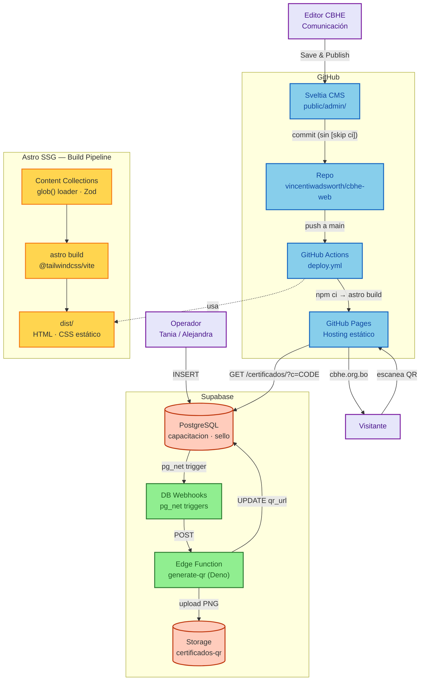

# Documentación Técnica — cbhe-web

> **Para**: desarrolladores. Para operar el sitio o emitir certificados, consulte las guías en el [README](./README.md).

**Última revisión**: 2026-07-08

---

## Stack

| Capa | Herramienta | Nota |
|---|---|---|
| SSG | Astro 6.x | Static output, zero JS |
| CSS | Tailwind v4 | `@tailwindcss/vite`, sin `@astrojs/tailwind` |
| Content | Zod + Content Collections | `src/content.config.ts`, loader `glob()`, `z` de `astro/zod` |
| CMS | Sveltia CMS | `public/admin/`, backend GitHub, `skip_ci: true` |
| Deploy | GitHub Pages | Workflow `deploy.yml`, repo público |
| Forms | Web3Forms | `WEB3FORMS_KEY` |
| Icons | astro-icon | `material-symbols` (59 seleccionados), guiones no underscores |
| Fonts | Inter self-hosted | `@fontsource/inter`, Latin subset 400–800 |
| Cert DB | Supabase Postgres | Tablas `capacitacion` y `sello`, RLS: `anon SELECT` + `service_role` CRUD |
| Cert storage | Supabase Storage | Bucket `certificados-qr` público, filename `{codigo}.png` |
| Auto-QR | Supabase Edge Function + DB Webhooks | `generate-qr` (Deno), trigger `pg_net` por INSERT en cada tabla |

---

## Quick Start

```bash
git clone https://github.com/vincentiwadsworth/cbhe-web.git
cd cbhe-web
npm install
npm run dev        # http://localhost:4321 — hot reload
```

Requisito: Node.js >= 22.12.0.

Variables de entorno mínimas (copiar `.env.example` a `.env`):

```ini
WEB3FORMS_KEY=your-key
VITE_SUPABASE_URL=your-project-url
VITE_SUPABASE_PUBLISHABLE_KEY=sb_publishable_xxx
```

---

## Estructura del proyecto

| Carpeta | Qué contiene |
|---|---|
| `src/pages/` | Rutas del sitio — cada `.astro` es una página pública |
| `src/components/` | Componentes reutilizables (Navbar, Footer, Cards, Form, etc.) |
| `src/layouts/` | Layouts base (`Layout.astro`, `PageLayout.astro`) |
| `src/content/` | Contenido del CMS — colecciones `articulos/`, `cursos/`, `empresas/`, `testimonios/` |
| `src/content.config.ts` | Definición de colecciones y esquemas Zod (`defineCollection`, `glob()`, `z`) |
| `src/lib/` | Utilidades compartidas (cliente Supabase) |
| `src/styles/` | Estilos globales (`global.css` con 50 tokens MD3) |
| `src/scripts/` | Scripts internos de Astro |
| `src/utils/` | Funciones de utilidad |
| `public/admin/` | Sveltia CMS — `index.html` + `config.yml`, panel de edición para el equipo CBHE |
| `public/images/` | Imágenes estáticas del sitio |
| `supabase/migrations/` | Migraciones SQL versionadas (001–005) |
| `supabase/functions/` | Edge Functions Deno — `generate-qr/` |
| `scripts/` | Scripts CLI de utilidad (emisión batch, procesamiento de imágenes) |
| `.github/workflows/` | GitHub Actions (`deploy.yml`, `issue-certificate.yml`, `update-data.yml`) |
| `openspec/` | Spec-driven development: `changes/`, `specs/`, `config.yaml` |
| `data/` | Datos estáticos (ej. `prices.json` para el widget de precios) |

---

## Build y deploy

### Comandos

```bash
npm run dev        # astro dev → http://localhost:4321 — hot reload
npm run build      # astro build → dist/
npm run preview    # astro preview — previsualizar el build estático
```

### Pipeline de deploy

El deploy es automático: cada push a `main` dispara `deploy.yml`:

1. `actions/checkout@v4` — clona el repo
2. `actions/setup-node@v4` — Node 22, cache npm
3. `npm ci` — instalación limpia
4. `npx astro build` — compila el sitio a `dist/`, con secrets inyectados como env vars
5. `actions/upload-pages-artifact@v3` — empaqueta `dist/`
6. `actions/deploy-pages@v4` — publica en GitHub Pages

URL de producción: `https://vincentiwadsworth.github.io/cbhe-web/`

### Custom domain

El dominio `cbhe.org.bo` está configurado en el repositorio (Settings → Pages → Custom domain) pero la propagación DNS está pendiente. Una vez activo, actualizar `site` en `astro.config.mjs`.

### Gotchas de deploy

| Problema | Razón | Fix |
|---|---|---|
| Assets rotos en preview local | `Astro.site` apunta a prod, el navegador bloquea los requests cross-origin (ORB) | Cambiar `site` en `astro.config.mjs` a `http://localhost:4321` temporalmente, rebuild, preview, restaurar |
| Runner saturado | GitHub Actions se queda en `Waiting for a hosted runner` | Disparar manual: `gh workflow run deploy.yml --ref main` |
| Links rotos en subpath | Astro `base` no modifica `<a href>` | Todos los links internos van sin `/` inicial (`href="quienes-somos"`) con `<base href={URL_CON_TRAILING_SLASH}>` en `Layout.astro` |

---

## Arquitectura del sistema



---

## Certificados — Sistema Dual

El sistema de certificados tiene dos tablas independientes en Supabase, cada una con su propio dominio de negocio, prefijo de código y RLS.

### Tablas

#### `public.capacitacion`

| Columna | Tipo | Descripción |
|---|---|---|
| `id` | `uuid PK` | Generado automáticamente |
| `codigo` | `text UNIQUE` | Prefijo `CBHE-C-` + 10 caracteres alfanuméricos aleatorios |
| `cursante_nombre` | `text` | Nombre de la persona certificada |
| `nombre_capacitacion` | `text NULL` | Nombre del curso o capacitación |
| `fecha_emision` | `date` | Fecha de emisión del certificado |
| `qr_url` | `text NULL` | URL pública del QR generado automáticamente |
| `created_at` | `timestamptz` | Timestamp de creación |

**Operador**: Alejandra  
**Vista simplificada**: `public.capacitacion_input` — expone `cursante_nombre`, `nombre_capacitacion`, `fecha_emision` y oculta columnas del sistema.

#### `public.sello`

| Columna | Tipo | Descripción |
|---|---|---|
| `id` | `uuid PK` | Generado automáticamente |
| `codigo` | `text UNIQUE` | Prefijo `CBHE-S-` + 10 caracteres alfanuméricos aleatorios |
| `empresa_nombre` | `text` | Nombre de la empresa certificada |
| `tipo_certificado` | `text` | Default `'Sello CBHE'` |
| `fecha_emision` | `date` | Fecha de emisión del certificado |
| `qr_url` | `text NULL` | URL pública del QR generado automáticamente |
| `created_at` | `timestamptz` | Timestamp de creación |

**Operador**: Tania  
**Vista simplificada**: `public.sello_input` — expone `empresa_nombre`, `fecha_emision` y oculta columnas del sistema.

### Pipeline Auto-QR

1. El operador inserta una fila en `capacitacion_input` o `sello_input` desde Supabase Studio
2. Un trigger `BEFORE INSERT` genera el código único con el prefijo correcto (`CBHE-C-` o `CBHE-S-`) usando `nanoid()`
3. Un trigger `pg_net` (`net.http_post()`) dispara la Edge Function `generate-qr` con el payload `{ record, table }`
4. La Edge Function (Deno) genera un PNG de 300px con `qrcode` (vía `esm.sh`), lo sube al bucket Storage `certificados-qr` (público), y ejecuta `UPDATE qr_url` en la fila correspondiente
5. La landing `/certificados/?c=CODIGO` detecta el prefijo del código, consulta la tabla correcta vía `anon SELECT`, y muestra los datos + QR

El pipeline es asíncrono: el QR puede tardar 1-2 segundos en aparecer. Si la columna `qr_url` queda en NULL, reintentar desde Supabase Dashboard → Database → Webhooks → Logs → Retry.

### RLS (Row-Level Security)

| Rol | `capacitacion` | `sello` |
|---|---|---|
| `anon` | SELECT | SELECT |
| `service_role` | CRUD completo | CRUD completo |

Las políticas `anon SELECT` están definidas explícitamente (migración 004). No hay scope por owner en RLS — la gestión de acceso por operador se hace a nivel de Supabase Studio.

### Verificación pública

La landing `/certificados/` recibe el código vía query string (`?c=CODIGO`):

- **Prefijo `CBHE-C-`** → consulta `capacitacion`. Muestra: nombre del cursante, nombre de la capacitación, fecha de emisión, tipo "Certificado de Capacitación"
- **Prefijo `CBHE-S-`** → consulta `sello`. Muestra: nombre de la empresa, tipo de certificado, fecha de emisión, tipo "Sello CBHE"
- **Prefijo no reconocido o código inexistente** → mensaje "Certificado No Encontrado"

Si la fila tiene `qr_url` no-NULL, se renderiza `` junto a los datos.

### Migraciones

| Archivo | Contenido |
|---|---|
| `001_certificados.sql` | Tabla `certificados` (legacy, ya eliminada) |
| `002_auto_generate_code.sql` | Función `nanoid()` y trigger de código en tabla legacy |
| `003_split_certificados.sql` | Rename `sello-cbhe` → `sello`, triggers con prefijos `CBHE-C-`/`CBHE-S-`, GRANTs, cleanup de funciones huerfanas |
| `004_anon_select_policies.sql` | Políticas `anon SELECT` explícitas para ambas tablas |
| `005_add_qr_url.sql` | Columna `qr_url` en ambas tablas |

> **Operación diaria**: ver **[Guía de Certificados](./GUIA-CERTIFICADOS.md)** para emitir, verificar y resolver errores.

---

## CMS — Sveltia

El panel de edición se sirve como archivos estáticos en `/admin/` (directorio `public/admin/`). Es una SPA que se comunica directamente con la API de GitHub — no tiene backend propio.

### Configuración

Archivo: `public/admin/config.yml`

```yaml
backend:
  name: github
  repo: vincentiwadsworth/cbhe-web
  branch: main
  skip_ci: false
```

- **Auth**: GitHub personal access token con scope `repo`. Sin OAuth proxy.
- **Save**: commit con `[skip ci]` → no dispara deploy (borrador)
- **Save and Publish**: commit sin `[skip ci]` → dispara deploy
- **Media**: `public/images/` → ruta pública `/images/`

### Colecciones

| Colección | Carpeta | Campos clave |
|---|---|---|
| `cursos` | `src/content/cursos/` | `title`, `category` (Curso/Certificación), `modality`, `image`, `startDate`, `price`, `canvaLink`, `instructors[]`, `draft` |
| `articulos` | `src/content/articulos/` | `title`, `category` (Noticias/Análisis/Eventos/Capacitación), `excerpt`, `date`, `image`, `featured`, `draft` |
| `empresas` | `src/content/empresas/` | `nombre`, `grupo` (6 opciones), `website`, `logo`, `destacada`, `orden` |
| `testimonios` | `src/content/testimonios/` | `name`, `role`, `company`, `quote`, `highlight`, `image` |

Cada colección se define en dos lugares que deben mantenerse sincronizados:
1. `public/admin/config.yml` — interfaz del CMS (widgets, labels, hints)
2. `src/content.config.ts` — validación Zod (tipos, defaults, opcionales)

> **Uso diario**: ver **[Guía de Editores](./GUIA-EDITORES.md)** para login, colecciones, flujo de publicación e imágenes.

---

## Variables de entorno

### Archivo `.env` (gitignored, desarrollo local)

| Variable | Descripción |
|---|---|
| `WEB3FORMS_KEY` | API key de Web3Forms para el formulario de contacto |
| `VITE_SUPABASE_URL` | URL del proyecto Supabase (prefijo `VITE_` requerido por Vite para exponer al cliente) |
| `VITE_SUPABASE_PUBLISHABLE_KEY` | Clave pública de Supabase (formato `sb_publishable_xxx`) |
| `SUPABASE_SECRET_KEY` | Clave `service_role` — solo para scripts server-side y GitHub Actions (nunca se expone al cliente) |
| `PUBLIC_VERIFICATION_URL` | URL base codificada en los QR (default: `https://cbhe.org.bo`) |
| `GROQ_KEY` | API key de Groq (chatbot, referencia legacy) |
| `DEEPSEEK_API_KEY` | API key de DeepSeek (chatbot) |

### Secrets de GitHub Actions

| Secret | Workflow | Uso |
|---|---|---|
| `WEB3FORMS_KEY` | `deploy.yml` | Inyectada como env var durante `astro build` |
| `VITE_SUPABASE_URL` | `deploy.yml` | Expuesta al cliente para el sistema de verificación |
| `VITE_SUPABASE_PUBLISHABLE_KEY` | `deploy.yml` | Expuesta al cliente |
| `SUPABASE_URL` | `issue-certificate.yml` | Emisión batch de certificados |
| `SUPABASE_SERVICE_ROLE_KEY` | `issue-certificate.yml` | Emisión batch con service_role |

### Secrets de Supabase (Edge Function)

La Edge Function `generate-qr` accede a estos vía `Deno.env.get()` — son secrets del proyecto Supabase, se configuran una vez con `supabase secrets set` y no requieren configuración adicional:

| Variable | Uso |
|---|---|
| `SUPABASE_URL` | URL del proyecto (para inicializar el cliente `supabase-js`) |
| `SUPABASE_SERVICE_ROLE_KEY` | Clave `service_role` (para UPDATE en las tablas) |
| `PUBLIC_VERIFICATION_URL` | URL base para codificar en el QR |

---

## Convenciones de desarrollo

### Git

- Conventional commits: `feat(scope): descripción`, `fix(scope): descripción`, `docs(scope): descripción`
- Sin `Co-Authored-By` ni atribución a IA en commits
- Rama principal: `main`
- No cerrar un issue sin `npx astro build` + verificación previa

### Astro 6 — Content Collections

- Configuración en `src/content.config.ts` (no `src/content/config.ts`)
- `import { z } from "astro/zod"` — no usar `astro:content` para Zod
- Loader obligatorio: `import { glob } from "astro/loaders"`
- Filtrado de borradores: `getCollection("name", ({ data }) => !data.draft)`

### Tailwind v4

- Configuración en CSS con `@theme { --color-*: ... }`, sin `tailwind.config.mjs`
- `@import "tailwindcss"` en vez de `@tailwind base/components/utilities`
- El plugin se carga vía `@tailwindcss/vite` en `astro.config.mjs`, no vía `@astrojs/tailwind`

### Links y navegación

- Todos los links internos van **sin `/` inicial**: `href="quienes-somos"`, no `href="/quienes-somos"`
- `<base href={URL_ABSOLUTA_CON_TRAILING_SLASH}>` en `Layout.astro` para resolver paths relativos
- `Astro.site` en `astro.config.mjs` define la URL absoluta de producción

### Íconos

- Biblioteca: `material-symbols` (59 seleccionados en `astro.config.mjs`)
- Sintaxis en componentes: `<Icon name="material-symbols:qr-code-2" />` — **con guiones**, no underscores
- Solo se incluyen en el bundle los íconos listados en `include` — los demás ni se descargan

### Diseño

- 50 tokens MD3 en `src/styles/global.css` (`--color-primary`, `--color-surface`, `--color-on-surface-variant`, etc.)
- Tailwind genera `bg-*`, `text-*`, `border-*` para todos los `--color-*`
- Tipografía: Inter Latin 400-800, self-hosted vía `@fontsource/inter`, sin dependencia de Google Fonts

### Supabase Edge Functions

- Runtime: **Deno, no Node**
- Imports vía `https://esm.sh/...` para librerías de Node (ej. `qrcode` → `https://esm.sh/qrcode@1.5.3`)
- Deploy con MCP OAuth (`supabase_deploy_edge_function`). Tokens PAT (`sbp_*`) no tienen scope `edge_functions:write`
- Secrets del proyecto (`SUPABASE_URL`, `SUPABASE_SERVICE_ROLE_KEY`) accesibles vía `Deno.env.get()` sin configuración extra
- Free tier: 500K invocaciones/mes, 2s CPU máximo por invocación

---

## Gotchas técnicos

| Problema | Explicación | Solución |
|---|---|---|
| **`<base href>` y paths root-relative** | Un path con `/` inicial reemplaza el path del base URL, no lo extiende. Ej: `<base href="/cbhe-web/">` + `href="/contacto"` → el navegador va a `/contacto`, no a `/cbhe-web/contacto` | Links siempre sin `/` inicial: `href="contacto"` |
| **`peer-checked:` no funciona en nietos** | Tailwind `peer-*` solo afecta hermanos directos del elemento `.peer`, no nietos | Reestructurar el markup para que el target sea hermano directo |
| **`BASE_URL` no tiene trailing slash** | `import.meta.env.BASE_URL` en Astro devuelve `/cbhe-web` sin barra final | Agregar manualmente: `` `${import.meta.env.BASE_URL}/gracias` `` |
| **Sveltia `skip_ci`** | El CMS configura `skip_ci: false` en `config.yml` pero el comportamiento real depende de si el usuario usa Save vs Save & Publish | No modificar el `skip_ci` en `config.yml` — el flujo de dos botones es intencional |
| **Preview local con custom domain** | `Astro.site` apunta a producción, `astro preview` en localhost pide assets cross-origin → ORB los bloquea → página sin CSS | Cambiar `site` a `http://localhost:4321`, rebuild, preview, restaurar. No intentar route interception en Playwright |
| **Runner de GitHub Actions saturado** | El job `deploy` puede quedarse en `Waiting for a hosted runner` por saturación de la plataforma | `gh workflow run deploy.yml --ref main` (disparo manual se procesa aunque los auto-triggers estén trabados) |
| **QR tarda en aparecer** | La Edge Function es asíncrona — el QR no se genera instantáneamente al insertar | Esperar 1-2 segundos. Si `qr_url` sigue NULL, reintentar desde Dashboard → Database → Webhooks → Logs → Retry |
| **DB Webhooks no bloquean la fila** | Los triggers `pg_net` disparan asíncrono. Si la Edge Function falla, la fila se inserta igual pero con `qr_url = NULL` | Retry manual desde Dashboard o re-disparo programático con `service_role` |
| **`sello-cbhe` ya no existe** | Renombrado a `sello` en la migración 003 | Usar `public.sello` en todas las queries |
| **`z` debe importarse de `astro/zod`** | Si se importa de `astro:content` o de `zod` directamente, Astro 6 no lo reconoce | `import { z } from "astro/zod"` |
| **Config de Content Collections cambió en Astro 6** | El archivo era `src/content/config.ts`, ahora es `src/content.config.ts` | Usar el nombre correcto y el loader `glob()` obligatorio |

---

## Documentos relacionados

- [README](./README.md) — resumen del proyecto, guías de operación y enlaces para el equipo CBHE
- [Guía de Editores](./GUIA-EDITORES.md) — operación del CMS para el equipo CBHE
- [Guía de Certificados](./GUIA-CERTIFICADOS.md) — emisión y verificación de certificados
- [Sobre el Proyecto](./SOBRE-EL-PROYECTO.md) — resumen ejecutivo, costos, DNS y entrega para directores
- [SPRINT-ENTREGA.md](./SPRINT-ENTREGA.md) — cambios del sprint activo y estado del proyecto
- [tour-del-proyecto.md](./tour-del-proyecto.md) — recorrido guiado de la arquitectura interna
- [AGENTS.md](./AGENTS.md) — convenciones completas para agentes y CI/CD
