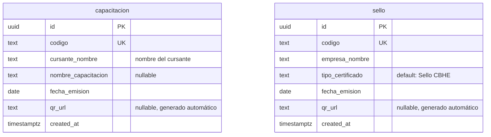
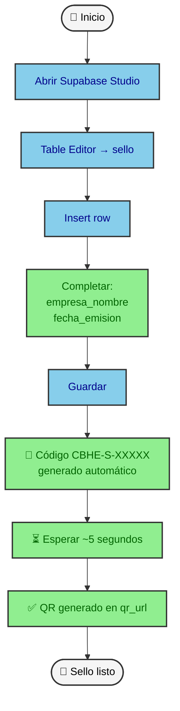
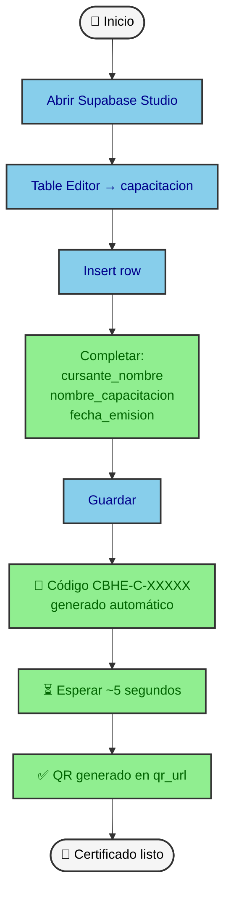
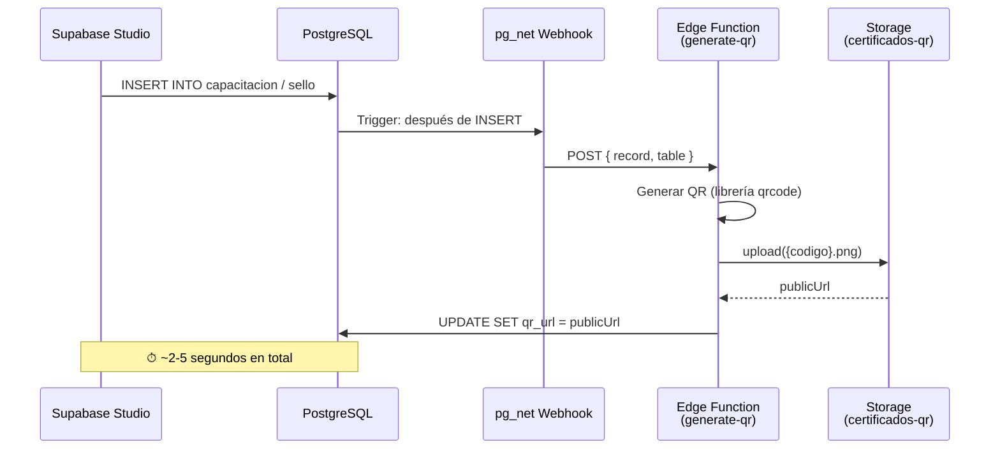
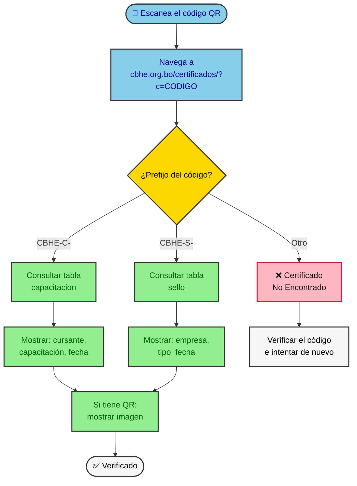

# Guía de Certificados — CBHE

> **Para**: Responsable de Gestión (Sello CBHE), Responsable de Capacitación
> **Última revisión**: 9 de julio de 2026

---

## Resumen rápido

- **Sello CBHE**: certificado para **empresas** que adquieren el sello de la CBHE. Código con prefijo `CBHE-S-XXXXX`.
- **Certificado de Capacitación**: certificado para **personas** que completaron un curso o certificación de la CBHE. Código con prefijo `CBHE-C-XXXXX`.

---

## 1. Sello CBHE vs Certificado de Capacitación

| Aspecto | Sello CBHE | Certificado de Capacitación |
|---|---|---|
| **¿Para quién?** | Empresas | Personas (cursantes) |
| **¿Quién lo emite?** | Responsable de Gestión | Responsable de Capacitación |
| **Tabla en el sistema** | `sello` | `capacitacion` |
| **Prefijo del código** | `CBHE-S-` | `CBHE-C-` |
| **Campos a completar** | `empresa_nombre`, `fecha_emision` | `cursante_nombre`, `nombre_capacitacion`, `fecha_emision` |
| **¿Quién puede verificar?** | Cualquier persona con el QR | Cualquier persona con el QR |

---

## 2. Cómo funciona el sistema



El sistema tiene **dos tablas independientes** en la base de datos. Cada una tiene su propia numeración automática, su propio trigger de QR y su propio acceso.

- **Prefijo `CBHE-C-`** → la verificación consulta automáticamente la tabla `capacitacion`.
- **Prefijo `CBHE-S-`** → la verificación consulta automáticamente la tabla `sello`.

El código se genera **solo** al guardar el registro. Usted no necesita escribir ni recordar ningún código.

---

## 3. Emitir un Sello CBHE



### Pasos

1. **Abrir Supabase Studio** en el navegador. Nicolás le proporciona el acceso.
2. Ir a **Table Editor** → seleccionar la tabla **`sello`** en el panel izquierdo.
3. Hacer clic en **Insert row**.
4. Completar **dos campos**:
   - `empresa_nombre`: nombre de la empresa que recibe el sello.
   - `fecha_emision`: fecha en que se emite el certificado.
5. Hacer clic en **Guardar**.
6. El sistema genera automáticamente el **código `CBHE-S-XXXXX`** y, en aproximadamente 5 segundos, el **código QR**.
7. El certificado está listo. Verifique que la columna `qr_url` tenga un valor (no esté vacía). Si está vacía, vea la [Sección 8](#8-procedimiento-ante-errores).

> **Nota**: también puede usar la vista `sello_input`, que muestra solo los dos campos necesarios y oculta los campos del sistema. El resultado es el mismo.

---

## 4. Emitir un Certificado de Capacitación



### Pasos

1. **Abrir Supabase Studio** en el navegador. Nicolás le proporciona el acceso.
2. Ir a **Table Editor** → seleccionar la tabla **`capacitacion`** en el panel izquierdo.
3. Hacer clic en **Insert row**.
4. Completar **tres campos**:
   - `cursante_nombre`: nombre completo de la persona que realizó el curso.
   - `nombre_capacitacion`: nombre del curso o certificación (opcional, puede quedar vacío).
   - `fecha_emision`: fecha en que se emite el certificado.
5. Hacer clic en **Guardar**.
6. El sistema genera automáticamente el **código `CBHE-C-XXXXX`** y, en aproximadamente 5 segundos, el **código QR**.
7. El certificado está listo. Verifique que la columna `qr_url` tenga un valor (no esté vacía). Si está vacía, vea la [Sección 8](#8-procedimiento-ante-errores).

> **Nota**: también puede usar la vista `capacitacion_input`, que muestra solo los tres campos necesarios y oculta los campos del sistema. El resultado es el mismo.

---

## 5. El QR se genera solo

No necesita hacer nada adicional. Cuando guarda un registro, el sistema dispara automáticamente esta secuencia:



> **Importante**: después de guardar, **espere unos 5 segundos** y refresque la vista de la tabla. La columna `qr_url` debe mostrar un enlace. Si pasados 30 segundos sigue vacía, vea la [Sección 8](#8-procedimiento-ante-errores).

---

## 6. Verificar un certificado

Cualquier persona con el código QR puede verificar la autenticidad escaneándolo con su teléfono:



### URL pública de verificación

```
https://cbhe.org.bo/certificados/?c=CBHE-C-Xg7Klm3NpQ
```

Reemplace `CBHE-C-Xg7Klm3NpQ` por el código real del certificado. El sistema detecta automáticamente si es un Sello (`CBHE-S-`) o una Capacitación (`CBHE-C-`) y muestra los datos correspondientes.

### Qué ve el público

| Si es... | El público ve |
|---|---|
| **Sello CBHE** | Nombre de la empresa, tipo de certificado, fecha de emisión, código de verificación y QR |
| **Capacitación** | Nombre del cursante, nombre del curso, fecha de emisión, código de verificación y QR |
| **Código inválido** | "Certificado No Encontrado" |

---

## 7. Roles y permisos

| Quién | Tabla | Qué puede hacer | Cómo accede |
|---|---|---|---|
| **Responsable de Gestión** | `sello` | Emitir sellos CBHE | Solicita a Nicolás, que opera Supabase Studio |
| **Responsable de Capacitación** | `capacitacion` | Emitir certificados de capacitación | Solicita a Nicolás, que opera Supabase Studio |
| **Nicolás** | `capacitacion` y `sello` | Crear, modificar y eliminar registros | Supabase Studio (acceso completo) |
| **Público** | `capacitacion` y `sello` | Verificar certificados (solo lectura) | Escaneando el QR o visitando la URL de verificación |

> **Nota**: el acceso a Supabase Studio está gestionado por Nicolás. Si la Responsable de Gestión o la Responsable de Capacitación necesitan acceso directo en el futuro, se puede configurar.

---

## 8. Procedimiento ante errores

| Error | Causa probable | Solución |
|---|---|---|
| `qr_url` aparece vacío después de guardar | El QR no se generó a tiempo o falló la Edge Function | **Espere 30 segundos** y refresque la tabla. Si sigue vacío, avise a Nicolás para reintentar desde Supabase Dashboard → Database → Webhooks → Logs → Retry. |
| El código QR escaneado muestra "Certificado No Encontrado" | El QR se generó pero el código no existe en la base de datos (fue eliminado) | Verifique en Supabase Studio que el registro existe en la tabla correcta. Si fue eliminado por error, solicite a Nicolás que lo restaure. |
| Insertó un sello en la tabla `capacitacion` (o viceversa) | Confusión entre las dos tablas al hacer Insert row | **No elimine el registro todavía.** Copie los datos, cree un nuevo registro en la tabla correcta, y luego solicite a Nicolás que elimine el registro equivocado. |
| La página de verificación muestra "Error de Verificación" | Servicio de Supabase caído o problema de conexión | Espere unos minutos y vuelva a intentar. Si el error persiste más de 15 minutos, avise a Nicolás. |
| El código generado tiene un formato incorrecto | Falla en el trigger de generación de código | Avisar a Nicolás. El código DEBE tener formato `CBHE-C-XXXXXXXXXX` (10 caracteres) o `CBHE-S-XXXXXXXXXX` (10 caracteres). |
| No puede acceder a Supabase Studio | Credenciales vencidas o problema de autenticación | Avisar a Nicolás para reestablecer el acceso. |

---

## 9. Resguardo de datos

Para tener un backup local de los certificados emitidos:

1. **En Supabase Studio**, vaya a **SQL Editor** y ejecute:
   ```sql
   SELECT * FROM public.capacitacion ORDER BY created_at DESC;
   ```
   Luego haga lo mismo para `sello`:
   ```sql
   SELECT * FROM public.sello ORDER BY created_at DESC;
   ```
2. **Exporte los resultados** a CSV usando el botón **Export** en el panel de resultados de Supabase Studio.
3. **Guarde el archivo CSV** en una carpeta segura de su computadora o en la carpeta compartida de la CBHE. Repita este procedimiento una vez por mes o después de cada lote grande de emisiones.

> **Recomendación**: guarde también una copia de cada QR generado. Puede descargar la imagen desde la columna `qr_url` en Supabase Studio (clic derecho → Guardar imagen).

---

## 10. Entregar al destinatario

Cuando el certificado está listo (código generado + QR visible en `qr_url`):

1. **Copie la URL del QR** desde la columna `qr_url` en Supabase Studio. Es una URL que termina en `.png`.
2. **Copie el enlace de verificación**:
   ```
   https://cbhe.org.bo/certificados/?c=CBHE-C-Xg7Klm3NpQ
   ```
   (Reemplace por el código real del certificado.)
3. **Envíe al destinatario por correo electrónico**:
   - Adjunte la imagen del QR (descargable desde `qr_url`).
   - Incluya el enlace de verificación en el cuerpo del correo.
   - Mencione que puede verificar la autenticidad escaneando el QR o visitando el enlace.
4. **Opcional**: si la empresa o cursante necesita el certificado impreso, descargue el QR como imagen PNG e insértelo en el documento de certificado que utilice la CBHE.

---

## Soporte técnico

Ante cualquier duda o problema con el sistema de certificados, contactar a:

- **Nicolás** — administrador técnico del sistema

---

## Documentos relacionados

- [Sobre el Proyecto](./README.md) — descripción general del proyecto para quien no es del área técnica
- [Documentación Técnica](./DOCUMENTACION-TECNICA.md) — stack tecnológico, arquitectura, build y deploy (para developers)
- [Guía para Editores del Sitio](./GUIA-EDITORES.md) — cómo gestionar el contenido del sitio web (artículos, cursos, empresas)
- [Pendientes de Despliegue](./PENDIENTES-DESPLIEGUE.md) — checklist de handoff y tareas pendientes
