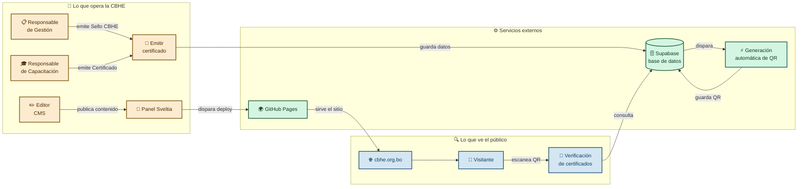

# cbhe-web

> Sitio web institucional de la Cámara Boliviana de Hidrocarburos y Energía.

## ¿Qué es este proyecto?

`cbhe-web` es el sitio web institucional de la CBHE, construido para que el equipo de la Cámara publique contenido, emita certificados digitales con código QR y permita al público verificarlos sin instalar nada. Reemplaza por completo al sitio anterior y le da al equipo independencia operativa: quienes publican y emiten no necesitan conocimientos técnicos ni depender de un desarrollador para las tareas diarias. La CBHE es dueña del código, los datos y la infraestructura. El costo operativo es de $0 por mes — la explicación detallada está más abajo.

## ¿Qué hace?

| Funcionalidad | Quién la usa | Cómo funciona |
|---|---|---|
| Sitio institucional | Público general | Páginas estáticas con información institucional, directorio de empresas afiliadas, artículos, cursos, formulario de contacto |
| CMS para editar contenido | Responsable de Comunicación, Responsable de Capacitación | Panel web Sveltia CMS: escribir, subir imágenes y publicar sin tocar código |
| Sello CBHE | Responsable de Gestión | Emitir el sello desde Supabase, el QR se genera de forma automática y el público puede verificarlo escaneándolo |
| Certificados de Capacitación | Responsable de Capacitación | Emitir el certificado desde Supabase, el QR se genera de forma automática y el público puede verificarlo escaneándolo |

## Arquitectura en 1 minuto

## ¿Cuánto cuesta operarlo?

**GitHub Pages** aloja el sitio sin costo porque el repositorio es público. Si el repositorio se volviera privado, el hosting gratuito se perdería. GitHub Pages no impone límite de tráfico ni almacenamiento.

**Supabase** provee la base de datos PostgreSQL, el almacenamiento de archivos y las funciones que generan los códigos QR. El plan gratuito incluye 500 MB de base de datos, 2 GB de almacenamiento y 500.000 ejecuciones de funciones por mes. Con el volumen proyectado de certificados —alrededor de 100 por año— el uso está por debajo del 1 % del límite.

Si alguna vez se excedieran los límites gratuitos de Supabase, el plan Pro cuesta aproximadamente $25 por mes. GitHub Pages seguiría sin costo.

**Total hoy: $0 por mes.**

## ¿Qué hace diferente a este sitio?

1. **QR automático.** Cuando la Responsable de Gestión o la Responsable de Capacitación emiten un certificado, el sistema detecta el nuevo registro, genera el código QR, lo almacena y lo asocia al certificado en segundos. No hay intervención manual en ningún paso del proceso.

2. **Verificación pública inmediata.** Cualquier persona puede verificar un certificado escaneando el QR con su teléfono. El sistema consulta la base de datos en el momento y muestra la información oficial del certificado. No se necesita aplicación, cuenta ni contraseña.

3. **Edición del sitio sin saber programar.** El equipo publica artículos, actualiza páginas, gestiona empresas afiliadas y administra cursos desde un panel web. No necesita HTML, no necesita un desarrollador, no necesita acceder al código fuente.

## Guías

- [Guía de Editores](./GUIA-EDITORES.md) — para quienes publican contenido en el sitio desde el panel CMS
- [Guía de Certificados](./GUIA-CERTIFICADOS.md) — para quienes emiten y verifican certificados con QR
- [Documentación Técnica](./DOCUMENTACION-TECNICA.md) — para desarrolladores que necesiten modificar o extender el sitio

## Preguntas frecuentes

- **¿Qué sucede si GitHub Pages deja de ser gratuito?** GitHub ofrece Pages sin costo para repositorios públicos desde 2008. Si las condiciones cambiaran, migrar el sitio a Cloudflare Pages o Netlify tomaría menos de una hora y también sería gratuito.

- **¿Qué sucede si se exceden los límites gratuitos de Supabase?** Con el volumen actual de certificados, el uso está por debajo del 1 % del límite. Si se excediera, el plan Pro cuesta aproximadamente $25 por mes y no requiere cambios en el código.

- **¿Qué sucede si el desarrollador del sitio no está disponible?** El código está documentado, las guías permiten al equipo operar sin asistencia técnica, y cualquier desarrollador con experiencia en sitios web puede clonar el repositorio y construir el sitio en minutos.

- **¿El código es público? ¿Es seguro?** El código del sitio es público porque es un requisito de GitHub Pages gratuito. Los datos de los certificados residen en Supabase con acceso restringido: solo personas autorizadas pueden emitir o modificar certificados. Lo que está expuesto al público es el sitio web y el código fuente, no los datos protegidos.
