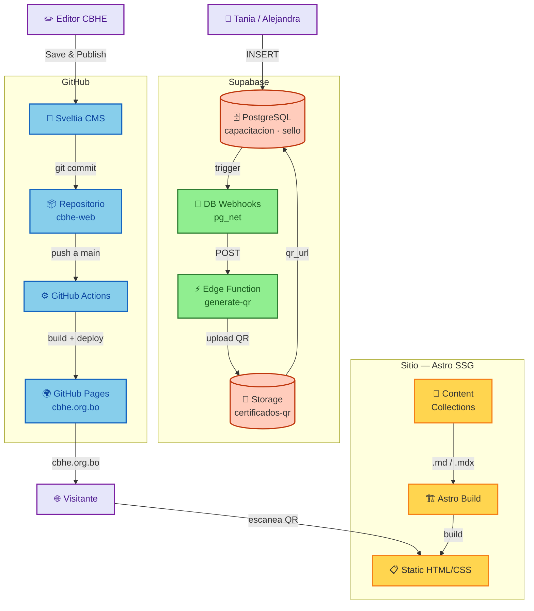

# cbhe-web

> Sitio web institucional de la Cámara Boliviana de Hidrocarburos y Energía.
>
> **Guías para el equipo CBHE**: [Guía de Editores](./GUIA-EDITORES.md) · [Guía de Certificados](./GUIA-CERTIFICADOS.md)

**Última revisión**: 2026-07-08

---

## Quick Start

```bash
git clone https://github.com/vincentiwadsworth/cbhe-web.git
cd cbhe-web
npm install
npm run dev        # http://localhost:4321
```

Requisitos: Node.js >= 22.12.0.

---

## Arquitectura del sistema



---

## Stack

| Capa | Herramienta | Nota |
|------|-------------|------|
| SSG | Astro 6.x | Static output, zero JS |
| CSS | Tailwind v4 | `@tailwindcss/vite`, sin `@astrojs/tailwind` |
| Content | Zod + Content Collections | `src/content.config.ts`, loader `glob()`, `z` de `astro/zod` |
| CMS | Sveltia CMS | `public/admin/`, backend GitHub, `skip_ci: true` |
| Deploy | GitHub Pages | Workflow `deploy.yml`, repo público |
| Forms | Web3Forms | `WEB3FORMS_KEY` |
| Icons | astro-icon | `material-symbols` (77 seleccionados) |
| Fonts | Inter self-hosted | `@fontsource/inter`, Latin subset 400–800 |
| Cert DB | Supabase Postgres | Tablas `capacitacion` y `sello`, RLS: `anon SELECT` + `service_role` CRUD |
| Cert storage | Supabase Storage | Bucket `certificados-qr` público, filename `{codigo}.png` |
| Auto-QR | Supabase Edge Function + DB Webhooks | `generate-qr` (Deno), trigger por INSERT en cada tabla |

---

## Estructura del proyecto

| Carpeta | Contenido |
|---------|-----------|
| `src/pages/` | Rutas del sitio — cada `.astro` es una página pública |
| `src/components/` | Componentes reutilizables (Navbar, Footer, Cards, Form, etc.) |
| `src/layouts/` | Layouts base (`Layout.astro`, `PageLayout.astro`) |
| `src/content/` | Contenido del CMS — colecciones `articulos/`, `cursos/`, `empresas/`, `testimonios/` |
| `src/content.config.ts` | Definición de colecciones y esquemas Zod |
| `src/lib/` | Utilidades compartidas (cliente Supabase) |
| `src/styles/` | Estilos globales (`global.css` con 50 tokens MD3) |
| `public/admin/` | Sveltia CMS — panel de edición para el equipo CBHE |
| `supabase/migrations/` | Migraciones SQL versionadas (001–005) |
| `supabase/functions/` | Edge Functions Deno — `generate-qr/` |
| `scripts/` | Scripts de utilidad (emisión batch, procesamiento de imágenes) |
| `.github/workflows/` | GitHub Actions (`deploy.yml`, `issue-certificate.yml`, `update-data.yml`) |

---

## Build y deploy

```bash
npm run build      # astro build → dist/
npm run preview    # previsualizar el build
```

El deploy es automático: cada push a `main` dispara `deploy.yml` que compila y publica en GitHub Pages.

### Gotchas de deploy

- **Links en subpath**: Astro `base` no modifica `<a href>`. Todos los links internos van SIN `/` inicial (`href="quienes-somos"`) con `<base href>` en `Layout.astro`.
- **`<base href>` con trailing slash**: sin la barra final, los paths relativos se resuelven mal.
- **Runner saturado**: si GitHub Actions se queda en `Waiting for a hosted runner`, disparar manual: `gh workflow run deploy.yml --ref main`.
- **Preview local con custom domain**: `Astro.site` apunta a producción y `astro preview` rompe los assets por ORB cross-origin. Workaround: cambiar `site` temporalmente a `http://localhost:4321`, rebuild, preview, restaurar.

---

## Certificados — Sistema Dual

El sistema de certificados tiene dos tablas independientes en Supabase:

| Tabla | Prefijo | Campos clave | Audiencia |
|-------|---------|-------------|-----------|
| `capacitacion` | `CBHE-C-XXXXXXXXXX` | `cursante_nombre`, `nombre_capacitacion`, `fecha_emision` | Alejandra |
| `sello` | `CBHE-S-XXXXXXXXXX` | `empresa_nombre`, `tipo_certificado`, `fecha_emision` | Tania |

### Pipeline Auto-QR

1. Operador inserta en `capacitacion_input` o `sello_input` (vistas simplificadas en Supabase Studio)
2. Trigger `BEFORE INSERT` genera código único con prefijo correcto
3. Trigger `pg_net` dispara la Edge Function `generate-qr` (Deno)
4. Edge Function genera QR PNG con `qrcode`, lo sube a Storage bucket `certificados-qr`
5. `UPDATE qr_url` en la fila para que la landing de verificación lo muestre

### Verificación pública

La landing `/certificados/?c=CODIGO` detecta el prefijo del código (`CBHE-C-` vs `CBHE-S-`), consulta la tabla correcta vía `anon` SELECT, y muestra los datos + QR.

> **Operación diaria**: ver **[Guía de Certificados](./GUIA-CERTIFICADOS.md)** para emitir, verificar y resolver errores.

### RLS

- `anon`: SELECT en ambas tablas (verificación pública)
- `service_role`: CRUD completo (batch, emergencias)
- Las vistas `_input` ocultan columnas del sistema (`id`, `codigo`, `qr_url`, `created_at`) para operadores no técnicos

---

## CMS — Sveltia

El panel de edición está en `/admin/` (archivos estáticos en `public/admin/`). Backend: GitHub (`skip_ci: true` por defecto — guardar sin publicar).

- **Save** = commit sin `[skip ci]` → no dispara deploy (guardar como borrador con cambios visibles solo para editores)
- **Save and Publish** = commit sin `[skip ci]` → dispara deploy
- Auth: GitHub personal access token (scope `repo`)

> **Uso diario**: ver **[Guía de Editores](./GUIA-EDITORES.md)** para login, colecciones, flujo de publicación e imágenes.

---

## Variables de entorno

Archivo `.env` (gitignored):

| Variable | Uso |
|----------|-----|
| `WEB3FORMS_KEY` | API key del formulario de contacto |
| `VITE_SUPABASE_URL` | URL del proyecto Supabase |
| `VITE_SUPABASE_PUBLISHABLE_KEY` | Clave pública (anon) de Supabase |
| `PUBLIC_VERIFICATION_URL` | URL base para codificar en los QR (default: `https://cbhe.org.bo`) |

Secrets de GitHub (configurados en Actions):

| Secret | Workflow |
|--------|----------|
| `WEB3FORMS_KEY` | `deploy.yml` |
| `SUPABASE_URL` | `issue-certificate.yml` |
| `SUPABASE_SERVICE_ROLE_KEY` | `issue-certificate.yml` |

La Edge Function `generate-qr` accede a `SUPABASE_URL` y `SUPABASE_SERVICE_ROLE_KEY` vía `Deno.env.get()` (secrets del proyecto Supabase, no requiere configuración extra).

---

## Desarrollo

```bash
npm run dev        # http://localhost:4321 — hot reload
npm run build      # build de producción → dist/
npm run preview    # preview del build estático
```

### Convenciones

- **Astro 6**: Content Collections con loader `glob()`, Zod desde `astro/zod`. Config en `src/content.config.ts`.
- **Tailwind v4**: configuración en CSS con `@theme { --color-*: ... }`. Sin `tailwind.config.mjs`.
- **Links internos**: siempre sin `/` inicial. Ej: `href="contacto"`, no `href="/contacto"`.
- **Íconos**: `material-symbols` con guiones (ej: `material-symbols:qr-code-2`). La lista completa está en `astro.config.mjs`.
- **Git**: conventional commits. Sin `Co-Authored-By`.
- **Sveltia CMS**: las colecciones se definen en `public/admin/config.yml`.
- **Supabase Edge Functions**: Deno, imports vía `https://esm.sh/...`. Deploy con MCP OAuth (tokens PAT `sbp_` no tienen scope `edge_functions:write`).

### Gotchas técnicas

| Problema | Razón | Fix |
|----------|-------|-----|
| Assets rotos en preview local | `Astro.site` apunta a prod, ORB bloquea cross-origin | Cambiar `site` en `astro.config.mjs` temporalmente |
| `peer-checked:` no funciona en nietos | Tailwind `peer-*` solo afecta hermanos directos | Reestructurar el markup |
| QR no aparece tras INSERT | Edge Function es asíncrona, tarda 1–2 min | Esperar o reintentar desde Dashboard → Webhooks → Logs → Retry |
| `sello-cbhe` ya no existe | Renombrado a `sello` en migración 003 | Usar `public.sello` |

---

## Documentos relacionados

- [Guía de Editores](./GUIA-EDITORES.md) — operación del CMS para el equipo CBHE
- [Guía de Certificados](./GUIA-CERTIFICADOS.md) — emisión y verificación de certificados
- [tour-del-proyecto.md](./tour-del-proyecto.md) — arquitectura interna detallada
- [SPRINT-ENTREGA.md](./SPRINT-ENTREGA.md) — cambios del sprint actual y estado del proyecto
- [AGENTS.md](./AGENTS.md) — convenciones completas del proyecto
