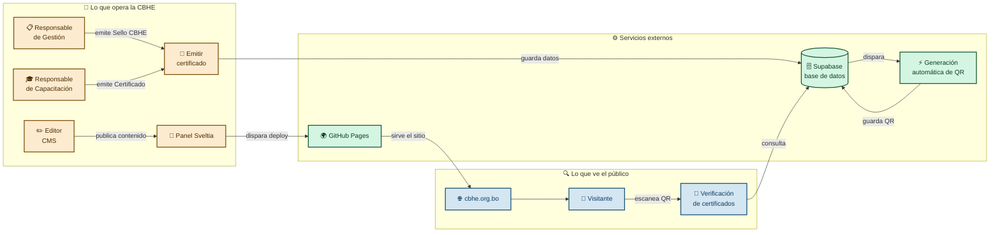

# Sitio web institucional de la CBHE

Este repositorio contiene el sitio web institucional de la Cámara Boliviana de Hidrocarburos y Energía, construido para que el equipo publique contenido, emita QR para sus certificados y permita al público verificarlos desde cualquier dispositivo (sin instalar software adicional). 

Esta web reemplaza al sitio anterior, actualizando la imagen institucional web de la CBHE y al mismo tiempo le da al equipo independencia operativa al equipo: quienes publican y emiten no necesitan conocimientos técnicos ni depender de un desarrollador para las tareas diarias. 

La CBHE es dueña del código, los datos y la infraestructura. El costo operativo es de $0 por mes (explicación detallada está más abajo).

## Características

| Funcionalidad | Quién la usa | Cómo funciona |
|---|---|---|
| Sitio institucional | Público general | Páginas estáticas con información institucional, directorio de empresas afiliadas, artículos, cursos, formulario de contacto |
| Edición de contenido | Responsable de Comunicación, Responsable de Capacitación | Sveltia CMS: Sistema de Gestión de Contenido (CMS) provee un panel que permite escribir, subir imágenes y publicar contenido en las categorías Cursos, Novedades y Empresas sin tocar código |
| Sello CBHE | Responsable de Gestión | Emitir el sello desde Supabase, el QR se genera de forma automática y el público puede verificarlo escaneándolo |
| Certificados de Capacitación | Responsable de Capacitación | Emitir el certificado desde Supabase, el QR se genera de forma automática y el público puede verificarlo escaneándolo |

## Arquitectura

## Costo operativo

**Sitio web** alojado sin costo mediante el servicio **Github Pages** con rendimiento profesional, sin límite de tráfico ni almacenamiento.

**Verificador de certificados** corre en una base de datos alojada en el servicio **Supabase**, que también provee el almacenamiento de archivos QR y las funciones que los generan. El plan gratuito incluye 500 MB de base de datos, 2 GB de almacenamiento y 500.000 ejecuciones de funciones por mes. Con el volumen proyectado de certificados —alrededor de 100 por año— el uso proyectado está **por debajo del 1 % del límite**.

Si alguna vez se excedieran los límites gratuitos de Supabase, el plan Pro cuesta aproximadamente $25 por mes. GitHub Pages seguiría sin costo.

## Valor agregado de este sitio

1. **Edición fácil y personalizada.** El equipo publica artículos, actualiza páginas, gestiona empresas afiliadas y administra cursos desde un panel web hecho a medida. No necesita HTML, no necesita un desarrollador, no necesita acceder al código fuente.

2. **QR automático.** Cuando la Responsable de Gestión o la Responsable de Capacitación registran un certificado, el sistema detecta el nuevo registro, genera el código QR, lo almacena y lo asocia al certificado en segundos, sin initervención manual.

3. **Verificación pública inmediata.** Cualquier persona puede verificar un certificado escaneando el QR con su teléfono. El sistema consulta la base de datos en el momento y muestra la información oficial del certificado. No se necesita aplicación, cuenta ni contraseña.

## Guías

- [Guía de Editores](./GUIA-EDITORES.md) — para quienes publican contenido en el sitio desde el panel CMS
- [Guía de Certificados](./GUIA-CERTIFICADOS.md) — para quienes emiten y verifican certificados con QR
- [Documentación Técnica](./DOCUMENTACION-TECNICA.md) — para desarrolladores que necesiten modificar o extender el sitio

## Preguntas frecuentes

- **¿Qué sucede si GitHub Pages deja de ser gratuito?** GitHub ofrece Pages sin costo para repositorios públicos desde 2008. Si las condiciones cambiaran, migrar el sitio a Cloudflare Pages o Netlify tomaría menos de una hora y también sería gratuito.

- **¿Qué sucede si se exceden los límites gratuitos de Supabase?** Con el volumen actual de certificados, el uso está por debajo del 1 % del límite. Si se excediera, el plan Pro cuesta aproximadamente $25 por mes y no requiere cambios en el código.

- **¿Qué sucede si el desarrollador del sitio no está disponible?** El código está documentado, las guías permiten al equipo operar sin asistencia técnica, y cualquier desarrollador con experiencia en sitios web puede clonar el repositorio y construir el sitio en minutos.

- **¿El código es público? ¿Es seguro?** El código del sitio es público porque es un requisito de GitHub Pages gratuito. Los datos de los certificados residen en Supabase con acceso restringido: solo personas autorizadas pueden emitir o modificar certificados. Lo que está expuesto al público es el sitio web y el código fuente, no los datos protegidos.
