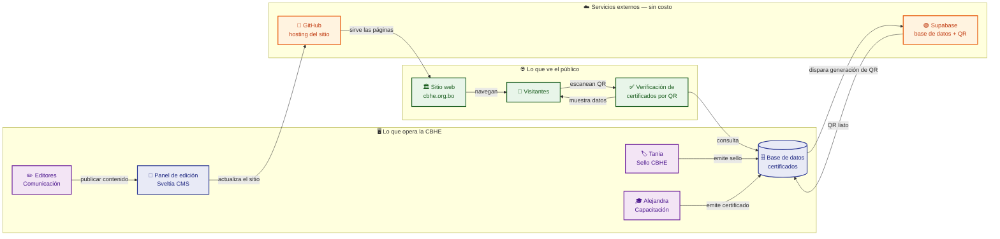

# Sobre el Proyecto — CBHE

> **Para**: Directores y stakeholders de la CBHE
> **Última revisión**: 9 de julio de 2026

## Resumen ejecutivo

El sitio web institucional de la CBHE fue rediseñado como un sitio estático de alto rendimiento, con un sistema dual de certificados digitales que permite emitir y verificar Sellos CBHE y Certificados de Capacitación con generación automática de códigos QR. El costo operativo mensual es de $0. La CBHE es dueña del código, los datos y las cuentas.

---

## Qué hace este sitio

| Funcionalidad | Quién la usa | Cómo funciona | Valor para la CBHE |
|---|---|---|---|
| **Sitio institucional** | Visitantes, prensa, empresas afiliadas | Páginas estáticas generadas en build: inicio, quiénes somos, novedades, RSE, capacitación, afiliadas, contacto | Presencia digital profesional con cero dependencia de servidores — el sitio no se puede "caer" |
| **CMS para editores** | Equipo de Comunicación | Panel web Sveltia CMS (`/admin/`): escribir, guardar borrador, publicar, subir imágenes | El equipo publica contenido sin depender de un desarrollador ni saber programar |
| **Sistema de Sello CBHE** | Tania | Insertar datos en tabla `sello` desde Supabase Studio → el QR se genera automáticamente → se puede verificar escaneando el QR | Emisión independiente de Sellos CBHE con verificación pública instantánea por QR |
| **Sistema de Certificados de Capacitación** | Alejandra | Insertar datos en tabla `capacitacion` desde Supabase Studio → el QR se genera automáticamente → se puede verificar escaneando el QR | Emisión independiente de certificados de capacitación con verificación pública instantánea por QR |

---

## Arquitectura en 1 minuto

---

## Costo operativo: $0 por mes

El costo es cero porque los dos servicios que sostienen el proyecto —GitHub Pages y Supabase— tienen planes gratuitos generosos que son más que suficientes para el volumen actual de la CBHE. No hay letra chica. Pero hay que entender por qué son gratuitos y qué pasa si eso cambia.

### GitHub Pages — hosting del sitio

GitHub Pages aloja y sirve las páginas del sitio sin costo **porque el repositorio es público**. Esta es una decisión consciente: el código del sitio es abierto (cualquiera puede verlo), y a cambio GitHub no cobra por el hosting ni por el tráfico, sin límite de visitas.

Si el repositorio se volviera privado, GitHub Pages dejaría de funcionar en el plan gratuito. Para mantenerlo privado con hosting, habría que pagar GitHub Team ($4/usuario/mes). La alternativa si se requiere privacidad en el futuro: migrar el hosting a Cloudflare Pages o Netlify —ambos tienen planes gratuitos con repositorios privados—, lo cual tomaría menos de una hora.

### Supabase — base de datos, almacenamiento y funciones

Supabase proporciona la base de datos PostgreSQL donde viven los certificados, el almacenamiento de las imágenes QR y la función serverless que genera los QR automáticamente. El plan gratuito incluye:

- **500 MB** de base de datos
- **2 GB** de almacenamiento de archivos
- **500.000 invocaciones** por mes de funciones serverless
- **50.000** usuarios autenticados mensuales

Con el volumen actual de la CBHE (~100 certificados por año), el uso está por debajo del 1% de cada límite. Si algún día se excedieran los límites gratuitos, el plan Pro de Supabase cuesta **$25/mes** —un costo marginal y predecible—.

No hay riesgo de que el sitio "se caiga". GitHub Pages no tiene límite de tráfico, y Supabase no suspende el servicio al exceder el límite gratuito: pasa a cobrar por uso excedente.

---

## Lo que no es común

### 1. Generación automática de QR

Cuando Tania o Alejandra emiten un certificado, el código QR se genera solo. No hay que diseñarlo, exportarlo ni subirlo manualmente. El sistema detecta el nuevo registro en la base de datos, dispara una función automática que genera la imagen QR, la almacena y la asocia al certificado en menos de 5 segundos. La persona que emite no hace nada distinto a insertar los datos del certificado.

### 2. Verificación pública en tiempo real

Cualquier persona puede verificar un certificado escaneando el QR con la cámara de su teléfono. El sistema consulta la base de datos en el momento y muestra los datos del certificado al instante: nombre del cursante o empresa, tipo de certificado, fecha de emisión. No requiere instalar una app, no requiere crear una cuenta, no requiere más que un navegador web. El QR es un link: no expira, no depende de un tercero, no se puede falsificar porque los datos se consultan en vivo contra la base de datos de la CBHE.

### 3. Edición del sitio sin programar

El equipo de Comunicación publica artículos, novedades, actualiza páginas y gestiona el contenido desde un panel web (Sveltia CMS). No necesita saber HTML, no necesita un desarrollador, no necesita acceso al código. El panel funciona igual que un editor de documentos: escribir, formatear, guardar. Tiene dos botones: **Save** (guardar como borrador, sin publicar) y **Save and Publish** (publicar en el sitio). Publicar dispara automáticamente un proceso que reconstruye el sitio entero y lo despliega —sin que el editor tenga que hacer nada más—.

---

## Reunión de entrega — Lo que hacemos juntos

Esta sección es el checklist de la reunión de handoff. Son tres acciones concretas, en orden. Al terminar, la CBHE tiene control total sobre el sitio, el dominio y los datos.

---

### 1. Crear la cuenta de GitHub de la CBHE

- Crear una cuenta gratuita en [github.com](https://github.com) con el correo `cbhe@cbhe.org.bo` (u otro correo institucional que designe la CBHE).
- Esta cuenta será la dueña del repositorio donde vive el código del sitio.
- Una vez creada, Nicolás transfiere el repositorio `cbhe-web` a esta cuenta. La transferencia es instantánea y no interrumpe el sitio.
- Después de la transferencia, la CBHE controla quién tiene acceso al código y quién puede modificarlo.

---

### 2. Transferir el repositorio

El repositorio pasa de `github.com/vincentiwadsworth/cbhe-web` a `github.com/cbhe-org/cbhe-web` (o el nombre de organización que elija la CBHE). Concretamente:

- **No rompe nada**: GitHub Pages sigue funcionando en la misma URL, el CMS Sveltia sigue publicando, los certificados siguen funcionando.
- **No cambia el sitio**: los visitantes no notan nada.
- **Lo único que cambia** es la URL de clone para developers. Se actualiza en la documentación interna.

---

### 3. Configurar el dominio `cbhe.org.bo`

Esto es lo que hace que el sitio aparezca en `cbhe.org.bo` en vez de `vincentiwadsworth.github.io/cbhe-web`. Requiere acceso al panel de administración del dominio, que actualmente está en `nic.bo`.

#### ¿Qué es un DNS?

Imaginá que internet es una ciudad gigante. Cada sitio web vive en una "casa" que tiene una dirección numérica —por ejemplo, `185.199.108.153`—. Pero pedirle a la gente que recuerde números sería imposible. El DNS (Domain Name System) es la guía telefónica de internet: traduce nombres (`cbhe.org.bo`) a direcciones numéricas (`185.199.108.153`).

Cuando alguien escribe `cbhe.org.bo` en su navegador, el DNS le dice: "el sitio de la CBHE está en los servidores de GitHub, andá a esta dirección". Sin el DNS correcto, el dominio `cbhe.org.bo` no llevaría a ningún lado —o peor, llevaría al sitio anterior—.

`nic.bo` es la entidad que administra los dominios `.bo` en Bolivia. Es el equivalente al registro civil de los dominios bolivianos: ellos tienen el registro oficial de qué dirección IP corresponde a cada dominio `.bo`. El dominio `cbhe.org.bo` ya está registrado a nombre de la CBHE —solo hay que decirle a `nic.bo` a dónde debe apuntar—.

#### Paso a paso: apuntar `cbhe.org.bo` a GitHub Pages

1. Acceder al panel de administración de `nic.bo` con las credenciales de la cuenta que administra `cbhe.org.bo`.
2. Ir a la sección de **DNS**, **registros DNS** o **zona DNS** (el nombre exacto varía según la versión del panel).
3. Agregar un registro **CNAME** con estos valores:
   - **Nombre**: `www`
   - **Valor**: `vincentiwadsworth.github.io`
   - **TTL**: automático o `3600`
4. Agregar **4 registros A** para que el dominio funcione también sin `www` (opcional pero recomendado):

   | Tipo | Nombre | Valor |
   |---|---|---|
   | A | `@` | `185.199.108.153` |
   | A | `@` | `185.199.109.153` |
   | A | `@` | `185.199.110.153` |
   | A | `@` | `185.199.111.153` |

5. En GitHub: ir al repositorio → **Settings** → **Pages** → **Custom domain** → escribir `cbhe.org.bo` → **Save**.
6. **Esperar**: el DNS puede tardar hasta 48 horas en propagarse globalmente. En la práctica, en Bolivia suele resolverse en 15 a 30 minutos.

> ⚠️ **Importante**: NO modificar los registros MX. Los MX controlan el correo electrónico (`@cbhe.org.bo`). Si se tocan sin saber exactamente qué se está haciendo, el correo institucional deja de funcionar.

---

## Después de la entrega

Una vez completada la reunión de handoff:

- La CBHE es dueña del **código** (repositorio en GitHub a nombre de la CBHE), el **dominio** (`cbhe.org.bo` administrado desde `nic.bo`) y los **datos** (certificados en Supabase, contenido del CMS en GitHub).
- El equipo de **Comunicación** opera el CMS de forma independiente: publicar artículos, novedades, actualizar páginas.
- **Tania y Alejandra** emiten certificados de forma independiente desde Supabase Studio.
- **Nicolás** queda disponible como soporte técnico para cambios que requieran programación, problemas con los certificados y actualizaciones de seguridad.

| Tipo de problema | Contacto | Canal |
|---|---|---|
| No puedo publicar en el CMS | Nicolás | WhatsApp / correo |
| Un certificado no aparece al escanear el QR | Nicolás | WhatsApp / correo |
| El sitio no carga o muestra errores | Nicolás | WhatsApp / correo |
| Quiero cambiar el diseño o agregar una sección nueva | Nicolás | WhatsApp / correo |
| Perdí el acceso al CMS | Nicolás | WhatsApp / correo |
| Quiero agregar un nuevo editor al CMS | Nicolás | WhatsApp / correo |
| Cambió el equipo y hay que rotar contraseñas | Nicolás | WhatsApp / correo |

---

## Preguntas frecuentes

### ¿Qué pasa si GitHub deja de ser gratuito?

GitHub Pages es gratuito para repositorios públicos desde 2008. Microsoft —dueño de GitHub desde 2018— no ha modificado esta política en 18 años. Si cambiara, migrar el hosting a otra plataforma de sitios estáticos (Cloudflare Pages, Netlify) tomaría menos de una hora. El sitio está construido con Astro, que genera HTML estático compatible con cualquier plataforma de hosting moderno. No hay dependencia de GitHub.

### ¿Qué pasa si Supabase excede el límite gratuito?

Con el volumen actual de la CBHE (~100 certificados por año, ~500 visitas mensuales al sitio), el uso está por debajo del 1% de cada límite del plan gratuito. Si eventualmente se excediera, el plan Pro de Supabase cuesta **$25/mes** e incluye 8 GB de base de datos, 100 GB de almacenamiento y 2 millones de invocaciones de funciones. Es un costo marginal y predecible. Supabase no interrumpe el servicio al exceder el límite gratuito: simplemente pasa a cobrar por uso.

### ¿Qué pasa si Nicolás no está disponible?

El proyecto está diseñado para que cualquier developer con experiencia en desarrollo web moderno pueda tomar el control. Concretamente:

- El `README.md` del repositorio permite clonar, instalar dependencias y buildear el sitio en menos de 5 minutos con dos comandos (`git clone`, `npm install && npm run build`).
- Las guías operativas (`GUIA-EDITORES.md` y `GUIA-CERTIFICADOS.md`) permiten al equipo de la CBHE operar el CMS y emitir certificados sin asistencia técnica.
- La arquitectura del sistema está documentada con diagramas en el mismo repositorio.
- La base de datos tiene migraciones versionadas que documentan cada cambio del schema.

No es un sistema propietario cerrado: es un sitio web estándar construido con herramientas de uso masivo (Astro, Tailwind, Supabase) que cualquier developer puede entender y mantener.

### ¿El código del sitio es público? ¿Eso no es un riesgo de seguridad?

El código del sitio es público —es un requisito de GitHub Pages en el plan gratuito—. Esto significa que cualquiera puede ver cómo está construido el sitio. Esto **no es un riesgo de seguridad** porque:

- El código público es el **frontend** del sitio: HTML, CSS, y la lógica de presentación. Es lo mismo que cualquier visitante ya puede ver inspeccionando la página con las herramientas del navegador.
- La **base de datos** de certificados no es pública. Supabase tiene RLS (Row Level Security) configurado: el público solo puede **leer** certificados individuales mediante un código específico, no puede listar todos los certificados ni modificarlos.
- Las **credenciales** (claves de API, contraseñas) nunca están en el código. Se almacenan como secretos en GitHub Actions y como variables de entorno en Supabase. Son inaccesibles para cualquier persona que no tenga acceso de administrador a esas plataformas.

El código abierto es una decisión consciente, no una limitación. De hecho, facilita que otro developer pueda auditar, mantener o migrar el sitio sin depender de documentación externa.
