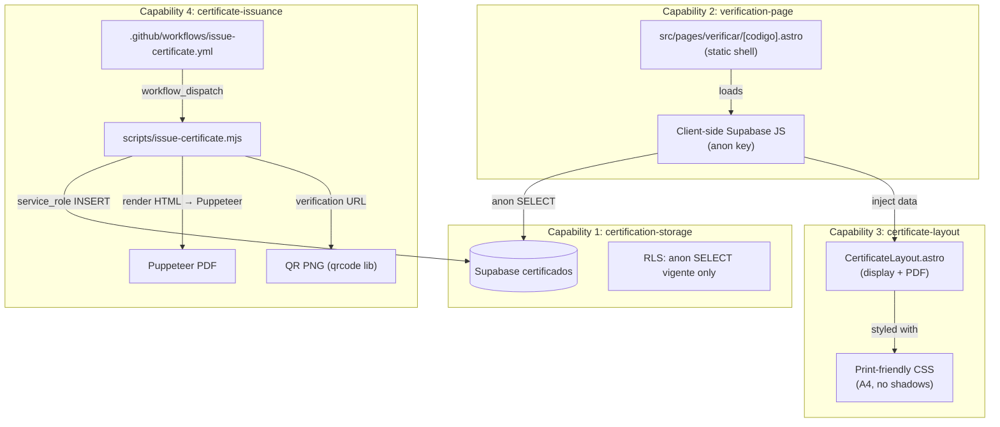

# Design: Sistema de Certificación y Verificación CBHE

## Technical Approach

Four loosely-coupled capabilities backed by a single Supabase `certificados` table. The site stays fully static (Astro SSG) — certificate data is fetched **client-side** by the verification page using `@supabase/supabase-js` with the `anon` key. Certificate issuance is an offline script + GitHub Actions `workflow_dispatch` that writes to Supabase with `service_role` and generates PDF + QR as workflow artifacts.

**Data flow summary:**

```
Issuance (offline)                     Verification (public)
─────────────────                      ─────────────────────
script/CI → Supabase INSERT            Browser → /verificar/CODIGO
         → Puppeteer PDF                          → client JS → Supabase SELECT
         → QR PNG (artifact)                      → render result card
```

## Architecture Diagram



## Architecture Decisions

### Decision: Client-side Supabase vs SSR adapter

| Option | Tradeoff | Decision |
|--------|----------|----------|
| Client-side Supabase JS | Zero infra cost, static site stays SSG, latency on lookup | **Chosen** |
| Astro SSR adapter | No client-side JS, but requires a server (Vercel/Node) | Rejected — adds infra complexity for <100 certs/year |

**Rationale**: The site is SSG on GitHub Pages. Adding an SSR adapter would break the zero-cost hosting model. Client-side fetch is fast enough for a single row lookup.

### Decision: Puppeteer in GitHub Actions vs local-only

| Option | Tradeoff | Decision |
|--------|----------|----------|
| Puppeteer in GitHub Actions CI | Requires headless Chrome in runner, but reproducible | **Chosen** |
| Local Puppeteer only | Requires Chrome on operator machine, inconsistent | Rejected — CI is the canonical environment |

**Rationale**: GitHub Actions `ubuntu-latest` has Chrome pre-installed. The script can also run locally for testing, but CI is the production path.

### Decision: Standalone HTML template vs Astro-rendered component for PDF

| Option | Tradeoff | Decision |
|--------|----------|----------|
| Standalone HTML string built in script | No Astro dependency, simpler | **Chosen** |
| Import and render .astro component via Vite | Requires Vite SSR pipeline, complex | Rejected — overkill for one template |

**Rationale**: The issuance script runs outside Astro's build. Importing `.astro` components requires the full Vite/Astro rendering pipeline which is fragile in a Node script. Instead, the script builds an HTML string that mirrors the `CertificateLayout.astro` visual design using the same design tokens as inline styles. The Astro component is used for on-screen display only.

### Decision: nanoid length 10 with URL-safe alphabet

| Option | Tradeoff | Decision |
|--------|----------|----------|
| nanoid(10) — 64-char alphabet | ~1M combinations, collision check handles it | **Chosen** |
| nanoid(12) | ~3.9M combinations, longer URLs | Rejected — 10 is enough for <100/year |
| UUID v4 | 36 chars, ugly in URLs | Rejected |

**Rationale**: With <100 certificates/year, nanoid(10) gives years of headroom. The collision check (SELECT before INSERT) is the safety net.

### Decision: QR error correction level M (15% recovery)

| Option | Tradeoff | Decision |
|--------|----------|----------|
| L (7%) | Smallest QR, less resilient | Rejected — certificates may be printed/scanned |
| M (15%) | Good balance of size and resilience | **Chosen** |
| Q/H (25-30%) | Maximum resilience, larger image | Rejected — overkill |

## Data Flow

### Issuance Flow (scripts/issue-certificate.mjs)

```
1. Parse CLI args (empresa_nombre, tipo_certificacion, fecha_emision, fecha_vencimiento?)
2. Generate nanoid(10) codigo
3. Check uniqueness → SELECT FROM certificados WHERE codigo = $1
   └─ If exists → regenerate (loop max 3 times, then fail)
4. INSERT INTO certificados (codigo, empresa_nombre, tipo_certificacion,
   fecha_emision, fecha_vencimiento, estado) VALUES (...)
5. Build verification URL: ${PUBLIC_VERIFICATION_URL}/verificar/${codigo}
6. Generate QR PNG → output/cert-${codigo}-qr.png
7. Build certificate HTML (standalone, design tokens as inline styles)
8. Launch Puppeteer → loadHTML → PDF (A4, portrait, no margins)
9. Save PDF → output/cert-${codigo}.pdf
10. Print summary to stdout
```

### Verification Flow (src/pages/verificar/[codigo].astro)

```
1. User scans QR or visits /verificar/CODIGO
2. Astro builds static shell at build time (all [codigo] params → placeholder pages)
   Wait — SSG can't enumerate infinite codes. Use [...slug] catch-all or
   single page with JS extraction? → See Decision below.
3. Client JS reads codigo from window.location.pathname
4. Create Supabase client (VITE_SUPABASE_URL, VITE_SUPABASE_ANON_KEY)
5. Show loading state (spinner/skeleton)
6. SELECT * FROM certificados WHERE codigo = $1
7. Route to result state:
   a. Row found + estado='vigente' → Success card (green tokens)
   b. Row found + estado≠'vigente' → Warning card (amber/error tokens)
   c. No row → Not found card (error tokens)
8. On fetch error → Error card with retry button
```

### Decision: Verification page — single static page with client-side routing

| Option | Tradeoff | Decision |
|--------|----------|----------|
| `src/pages/verificar/index.astro` — single page, JS extracts code from URL | No getStaticPaths needed, always exists | **Chosen** |
| `src/pages/verificar/[codigo].astro` with getStaticPaths | Must enumerate codes at build time — impossible for dynamic data | Rejected |

**Rationale**: Since certificates are created dynamically in Supabase AFTER build, `[codigo].astro` can't enumerate them. Instead, a single `verificar/index.astro` page serves as the shell. The client JS extracts the code from the URL path (`/verificar/ABC123` → `ABC123`).

**URL handling**: A `public/verificar/` directory isn't viable. Instead, use a small client script that reads `window.location.pathname.split('/verificar/')[1]`. GitHub Pages serves 404 for unknown paths, so we need a custom 404 redirect or a catch-all.

**Solution**: Add a `public/verificar/index.html` redirect OR use the existing 404 page. Better: create `src/pages/verificar/[...codigo].astro` with a single static path fallback — Astro will generate `verificar/index.html` and the client JS handles the rest. Actually, the simplest approach:

1. Create `src/pages/verificar/[codigo].astro` 
2. Add `getStaticPaths()` that returns a single placeholder: `[{ params: { codigo: "index" } }]`
3. Client JS reads the actual code from `location.pathname`
4. Add `public/verificar/.nojekyll` and configure Pages to use 404.html fallback

**Final approach**: Use `src/pages/verificar/index.astro` as a single page. QR codes point to `/verificar/?c=CODIGO` format (query param). This avoids all catch-all/routing issues on GitHub Pages. The page is a single static file at `/verificar/index.html`.

**Revised URL format**: `https://cbhe.org.bo/verificar/?c=ABC123def45`

This is simpler and works perfectly on static hosting.

## File Changes

| File | Action | Description |
|------|--------|-------------|
| `src/pages/verificar/index.astro` | Create | Static verification page shell with client-side Supabase lookup |
| `src/components/CertificateLayout.astro` | Create | Reusable certificate display component (on-screen rendering) |
| `src/components/CertificateResult.astro` | Create | Result card component for verification states (found/not-found/error) |
| `scripts/issue-certificate.mjs` | Create | Issuance script: nanoid gen, Supabase insert, QR + PDF generation |
| `.github/workflows/issue-certificate.yml` | Create | workflow_dispatch with inputs, runs issuance script, uploads artifacts |
| `supabase/schema.sql` | Create | DDL for certificados table + RLS policies (reference, run manually) |
| `astro.config.mjs` | Modify | Add `/verificar` to sitemap filter exclusion |
| `public/robots.txt` | Modify | Add `Disallow: /verificar` |
| `package.json` | Modify | Add deps: `@supabase/supabase-js`, `qrcode`; devDeps: `puppeteer` |
| `.env.example` | Modify | Add `VITE_SUPABASE_URL`, `VITE_SUPABASE_ANON_KEY`, `PUBLIC_VERIFICATION_URL` |
| `.github/workflows/deploy.yml` | Modify | Pass `VITE_SUPABASE_URL`, `VITE_SUPABASE_ANON_KEY` env vars to build |

## Interfaces / Contracts

### Supabase Table DDL

```sql
CREATE TABLE public.certificados (
  id              uuid        PRIMARY KEY DEFAULT gen_random_uuid(),
  codigo          text        NOT NULL UNIQUE,
  empresa_nombre  text        NOT NULL,
  tipo_certificacion text     NOT NULL,
  fecha_emision   date        NOT NULL,
  fecha_vencimiento date      ,           -- nullable: some certs don't expire
  estado          text        NOT NULL DEFAULT 'vigente'
                    CHECK (estado IN ('vigente', 'vencido', 'revocado')),
  created_at      timestamptz NOT NULL DEFAULT now()
);

-- Enable RLS
ALTER TABLE public.certificados ENABLE ROW LEVEL SECURITY;

-- anon can only see vigente rows
CREATE POLICY "anon_read_vigente" ON public.certificados
  FOR SELECT
  TO anon
  USING (estado = 'vigente');

-- authenticated can see vigente rows (future-proofing)
CREATE POLICY "authenticated_read_vigente" ON public.certificados
  FOR SELECT
  TO authenticated
  USING (estado = 'vigente');

-- Grant Data API access (separate from RLS)
GRANT SELECT ON public.certificados TO anon;
GRANT SELECT ON public.certificados TO authenticated;

-- service_role has full access by default (bypasses RLS)
-- No additional grants needed for service_role

-- Index for lookup by codigo (primary query path)
CREATE INDEX idx_certificados_codigo ON public.certificados (codigo);
```

### CertificateLayout.astro Props

```typescript
export interface Props {
  /** Company name displayed on the certificate */
  empresa_nombre: string;
  /** Type of certification (e.g., "ISO 9001", "Seguridad Industrial") */
  tipo_certificacion: string;
  /** Issue date */
  fecha_emision: string;       // YYYY-MM-DD, formatted for display in component
  /** Expiry date (null = no expiry) */
  fecha_vencimiento?: string;  // YYYY-MM-DD or undefined
  /** Current status */
  estado: 'vigente' | 'vencido' | 'revocado';
  /** Verification code */
  codigo: string;
  /** Optional: QR code data URL for embedding */
  qrDataUrl?: string;
}
```

### CertificateResult.astro Props

```typescript
export interface Props {
  /** Result state */
  state: 'vigente' | 'no_vigente' | 'not_found' | 'error';
  /** Certificate data (null if not_found or error) */
  data?: {
    empresa_nombre: string;
    tipo_certificacion: string;
    fecha_emision: string;
    fecha_vencimiento?: string;
    estado: string;
    codigo: string;
  };
}
```

### Issuance Script CLI

```bash
node scripts/issue-certificate.mjs \
  --empresa "Repsol E&P Bolivia S.A." \
  --tipo "Seguridad Industrial" \
  --emision 2026-05-28 \
  [--vencimiento 2027-05-28]

# Env vars required:
#   SUPABASE_URL           — Supabase project URL
#   SUPABASE_SERVICE_ROLE_KEY — service_role key for INSERT
#   PUBLIC_VERIFICATION_URL   — base URL for QR (e.g., https://cbhe.org.bo)

# Output:
#   output/cert-{codigo}.pdf
#   output/cert-{codigo}-qr.png
#   stdout: JSON summary { codigo, url, pdf, qr }
```

### QR Code Configuration

```
Library:     qrcode (npm)
Size:        300x300 px
EC Level:    M (15% recovery)
Format:      PNG
Content:     {PUBLIC_VERIFICATION_URL}/verificar/?c={codigo}
Margin:      2 modules
Color:       #01406c (primary navy) on white
```

### Puppeteer PDF Configuration

```
Page size:   A4 (210 x 297 mm)
Orientation: Portrait
Scale:       1.0
Margins:     15mm all sides
Print BG:    true
Format:      pdf
```

## Testing Strategy

| Layer | What to Test | Approach |
|-------|-------------|----------|
| Unit | nanoid generation + uniqueness check | Run script with `--dry-run` flag (generates code, validates, but skips INSERT/PDF) |
| Integration | Supabase INSERT + SELECT round-trip | Manual: run script against dev Supabase instance, verify via Dashboard |
| Integration | PDF output correctness | Manual: inspect generated PDF visually |
| E2E | Full verification flow | Manual: scan QR / visit URL, verify all 3 states render correctly |
| Visual | CertificateLayout component | `astro dev` → navigate to test page with mock data |
| Regression | `astro build` succeeds | CI: run `npx astro build` with new env vars |

## Configuration

### Environment Variables

| Variable | Scope | Description |
|----------|-------|-------------|
| `VITE_SUPABASE_URL` | Build + client | Supabase project URL (exposed to client) |
| `VITE_SUPABASE_ANON_KEY` | Build + client | Supabase anon key (public, read-only via RLS) |
| `PUBLIC_VERIFICATION_URL` | Build + script | Base URL for QR codes (`https://cbhe.org.bo`, no trailing slash) |
| `SUPABASE_SERVICE_ROLE_KEY` | Script/CI only | Supabase service_role key (secret, never in client) |
| `SUPABASE_URL` | Script/CI only | Non-prefixed version for the issuance script (server-side) |

### GitHub Secrets

| Secret | Used In | Description |
|--------|---------|-------------|
| `VITE_SUPABASE_URL` | deploy.yml, issue-certificate.yml | Same value as env var |
| `VITE_SUPABASE_ANON_KEY` | deploy.yml, issue-certificate.yml | Same value as env var |
| `SUPABASE_SERVICE_ROLE_KEY` | issue-certificate.yml | For INSERT operations |
| `PUBLIC_VERIFICATION_URL` | issue-certificate.yml | QR code base URL |

### Sitemap Exclusion

```javascript
// astro.config.mjs — updated sitemap filter
sitemap({
  filter: (page) => !page.includes("/gracias") && !page.includes("/verificar"),
}),
```

### robots.txt Addition

```
Disallow: /verificar
```

## Migration / Rollout

1. **Create Supabase project** (if not existing) — manual setup via dashboard
2. **Run schema.sql** — execute DDL + RLS in Supabase SQL editor
3. **Configure GitHub Secrets** — add 4 secrets
4. **Add npm dependencies** — `@supabase/supabase-js`, `qrcode`, `puppeteer` (dev)
5. **Deploy code** — standard PR → merge → deploy pipeline
6. **Test issuance** — run workflow_dispatch with test data
7. **Configure domain redirect** — set up `github.io/cbhe-web/verificar/*` → `cbhe.org.bo/verificar/*` redirect when ready
8. **First real certificate** — issue via workflow_dispatch

No feature flags needed. The feature is inert until someone triggers the issuance workflow.

## Open Questions

- [x] **Q1 (estado auto-transición)**: Manual. <100/año, no se justifica un cron.
- [x] **Q2 (QR URL permanence)**: `PUBLIC_VERIFICATION_URL` env var. Configurar redirect antes de emitir.
- [x] **Q3 (sitemap)**: Excluir `/verificar/*` del sitemap.
- [x] **Q4 (PDFs en repo)**: Solo como workflow artifacts. NO en el repo.
- [ ] **Q5 (Supabase project)**: Does a Supabase project already exist for CBHE, or does one need to be created from scratch? Affects deployment step 1.
